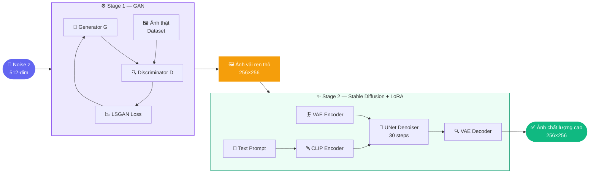
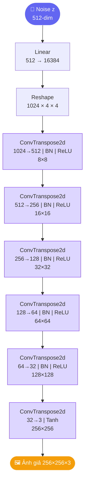
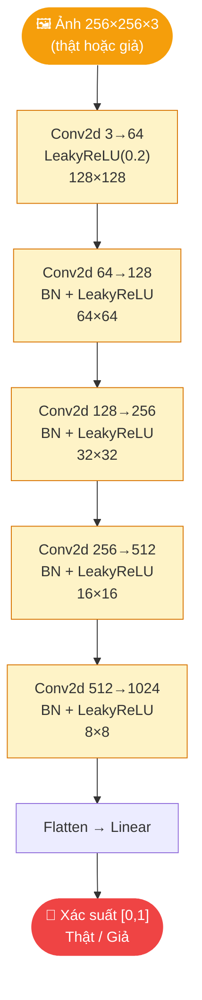
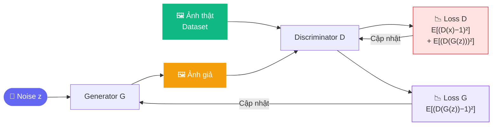
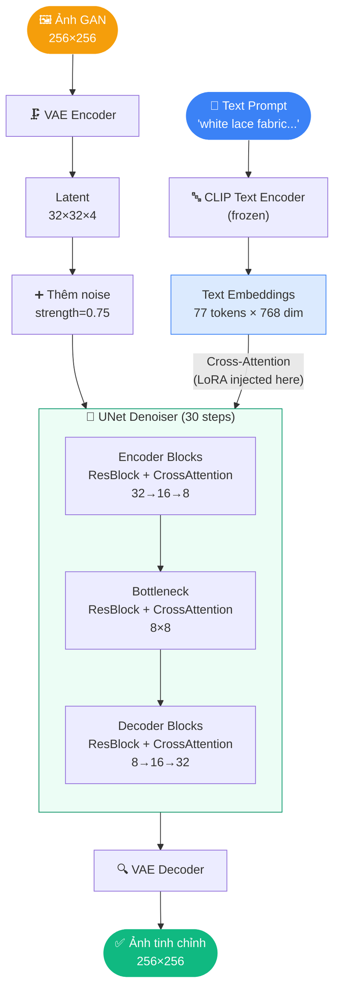
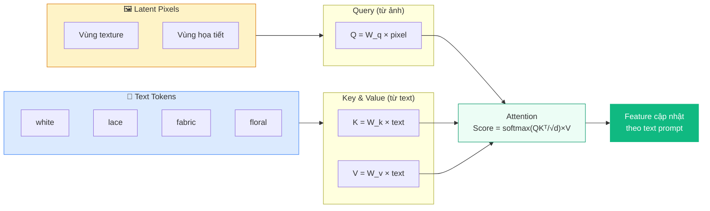
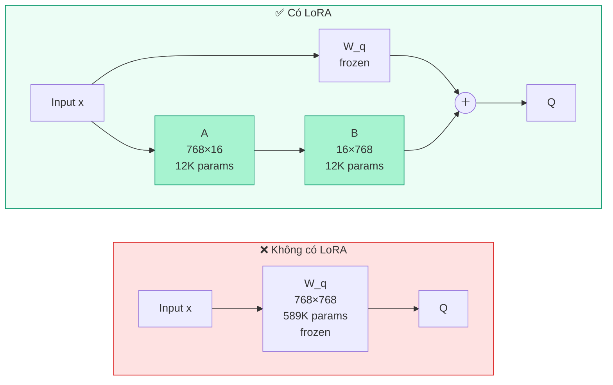
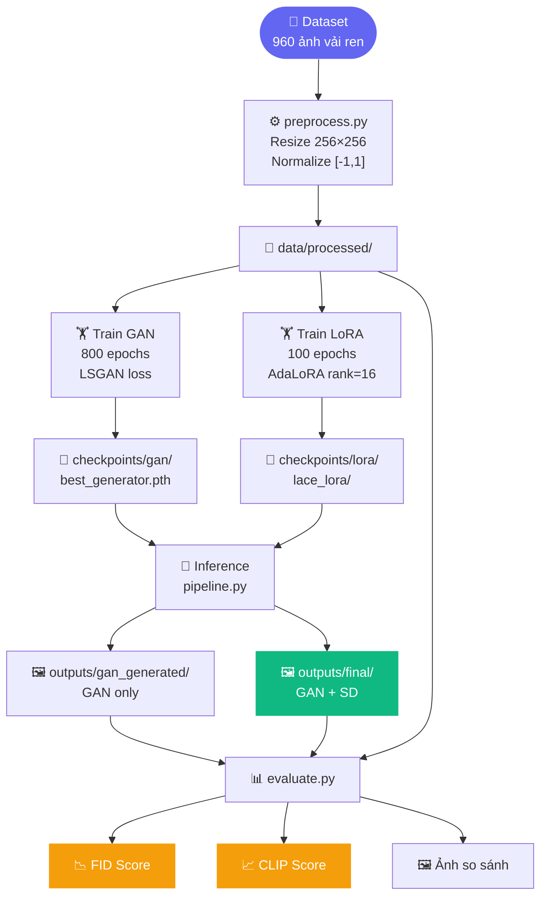

# 🧵 Sinh Tổng Hợp Vải Ren — GAN + Stable Diffusion

> **Đề tài:** Synthetic Fabric Texture Generation Using GAN and Stable Diffusion  
> **Môn học:** Machine Learning  
> **Nhóm thực hiện:** haluu07  
> **Server:** 2× NVIDIA RTX A4000 (16GB VRAM) | Ubuntu 24.04 | CUDA 12.1

---

## 📌 Tóm tắt

Dự án xây dựng pipeline 2 giai đoạn để tổng hợp ảnh vải ren chất lượng cao từ nhiễu ngẫu nhiên:

| Giai đoạn | Mô hình | Đầu vào | Đầu ra |
|---|---|---|---|
| Stage 1 | GAN (LSGAN) | Noise vector z (512 chiều) | Ảnh vải ren 256×256 |
| Stage 2 | Stable Diffusion 1.5 + LoRA | Ảnh GAN + Text prompt | Ảnh tinh chỉnh 256×256 |

**Dataset:** 960 ảnh vải ren thu thập từ internet, tiền xử lý về 256×256.

---

## 🗺️ Sơ đồ tổng quan hệ thống



---

## 🧠 Thuật toán chi tiết

### STAGE 1 — GAN

#### Kiến trúc Generator



#### Kiến trúc Discriminator



#### Quá trình đối kháng GAN



---

### STAGE 2 — Stable Diffusion + LoRA

#### Kiến trúc tổng thể Stage 2



#### Cross-Attention: Cơ chế text điều khiển ảnh



#### LoRA — Fine-tune hiệu quả



---

## 📊 Luồng dữ liệu (Data Flow)



---

## 📁 Cấu trúc dự án

```
lace-gan-diffusion/
├── 📄 config.yaml              # Cấu hình trung tâm (LR, epochs, paths...)
├── 📄 requirements.txt         # Danh sách thư viện
├── 📄 preprocess.py            # Resize + normalize dataset
├── 📄 train_lora.py            # Fine-tune LoRA trên SD 1.5
├── 📄 app.py                   # Giao diện web Gradio (demo)
├── 📄 plot_clip_score.py       # Vẽ biểu đồ so sánh CLIP score
│
├── 📁 stage1_gan/              # ═══ GIAI ĐOẠN 1: GAN ═══
│   ├── dataset.py              # LaceDataset: load + augment ảnh
│   ├── model.py                # Generator + Discriminator (LSGAN)
│   ├── losses.py               # LSGAN loss + Perceptual loss
│   └── train.py                # Training loop: checkpoint, sample, log
│
├── 📁 stage2_diffusion/        # ═══ GIAI ĐOẠN 2: DIFFUSION ═══
│   ├── refiner.py              # SD img2img pipeline (tối ưu VRAM)
│   └── prompts.py              # Style → text prompt mapping
│
├── 📁 inference/               # ═══ SINH ẢNH & ĐÁNH GIÁ ═══
│   ├── pipeline.py             # End-to-end: GAN → SD → output
│   ├── evaluate.py             # FID + CLIP + ảnh so sánh
│   └── compute_fid.py          # Tính FID độc lập
│
├── 📁 data/
│   ├── raw/                    # ← Đặt dataset vào đây
│   └── processed/              # Tự động tạo sau preprocess
│
├── 📁 checkpoints/
│   ├── gan/                    # GAN checkpoints
│   └── lora/lace_lora/         # LoRA weights
│
└── 📁 outputs/
    ├── gan_generated/          # Ảnh Stage 1 (GAN only)
    ├── final/                  # Ảnh Stage 2 (full pipeline)
    └── gan_samples/            # Sample ảnh mỗi epoch
```

---

## ⚙️ Cài đặt & Chạy

### Cài thư viện

```bash
pip install -r requirements.txt
# CUDA 12.1:
pip install torch torchvision --index-url https://download.pytorch.org/whl/cu121
```

### Chạy từng bước

```bash
# 1. Tiền xử lý dataset
python preprocess.py --size 256

# 2. Train GAN
python stage1_gan/train.py --config config.yaml

# 3. Fine-tune LoRA
python train_lora.py --config config.yaml

# 4. Sinh ảnh (full pipeline)
python inference/pipeline.py --config config.yaml --style vintage --num_images 4

# 5. Đánh giá
python inference/evaluate.py --real_dir data/processed --refined_dir outputs/final

# 6. Demo web
python app.py  # http://localhost:7860
```

---

## 📊 Kết quả thực nghiệm

| Metric | GAN (Stage 1) | GAN + SD (Stage 2) | Ý nghĩa |
|---|---|---|---|
| **FID ↓** | 359.53 | 359.53* | Khoảng cách phân phối với ảnh thật |
| **CLIP Score ↑** | 21.45 | 21.51 | Độ tương đồng ảnh–text |

> ⚠️ FID cần ≥ 2048 ảnh để có ý nghĩa thống kê. Dataset nhỏ (< 10 ảnh test) khiến FID không đáng tin cậy. Visual quality cải thiện rõ thấy ở Stage 2.

---

## ⚙️ Cấu hình quan trọng

| Tham số | Giá trị | Ý nghĩa |
|---|---|---|
| `data.image_size` | 256 | Độ phân giải training |
| `stage1_gan.epochs` | 800 | Số epoch train GAN |
| `stage1_gan.lr_g` | 3×10⁻⁵ | Learning rate Generator |
| `stage1_gan.loss_type` | lsgan | Hàm loss |
| `stage2_diffusion.strength` | 0.75 | Mức độ Diffusion (0=giữ GAN, 1=bỏ GAN) |
| `stage2_diffusion.guidance_scale` | 9.0 | Tuân theo prompt (7–15) |
| `stage2_diffusion.num_inference_steps` | 30 | Số bước khử noise |

---

## 💡 Hướng cải tiến

| Cải tiến | Lợi ích |
|---|---|
| **StyleGAN2-ADA** | Giảm mode collapse, tốt hơn cho dataset nhỏ |
| **ControlNet** | Kiểm soát cấu trúc tốt hơn img2img |
| **SD XL Turbo** | Giảm inference từ ~30s xuống ~3s |
| **FID đáng tin** | Sinh ≥ 2048 ảnh để FID có ý nghĩa |

---

## 📚 Tài liệu tham khảo

| Paper | Năm | Liên quan |
|---|---|---|
| Goodfellow et al. — *Generative Adversarial Networks* | 2014 | Nền tảng GAN |
| Mao et al. — *Least Squares GAN* | 2017 | Hàm loss Stage 1 |
| Ho et al. — *DDPM* | 2020 | Nền tảng Diffusion |
| Rombach et al. — *Latent Diffusion (Stable Diffusion)* | 2022 | Stage 2 backbone |
| Hu et al. — *LoRA* | 2021 | Fine-tune Stage 2 |
| Radford et al. — *CLIP* | 2021 | Text encoder + evaluation |
| Karras et al. — *StyleGAN2-ADA* | 2020 | Hướng cải tiến |
